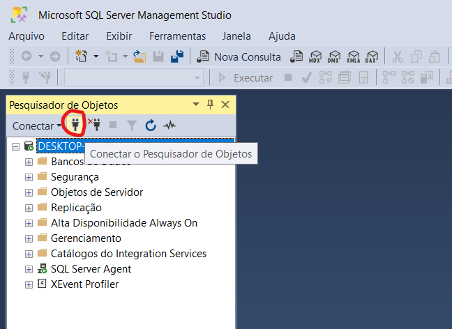
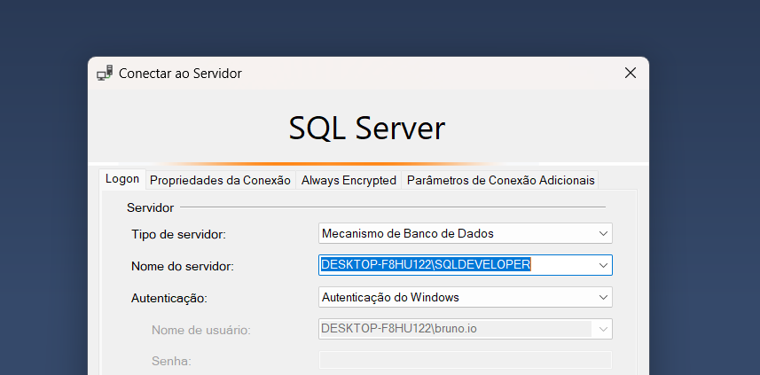
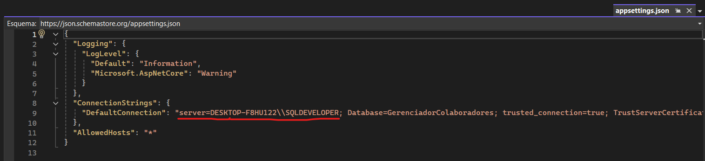
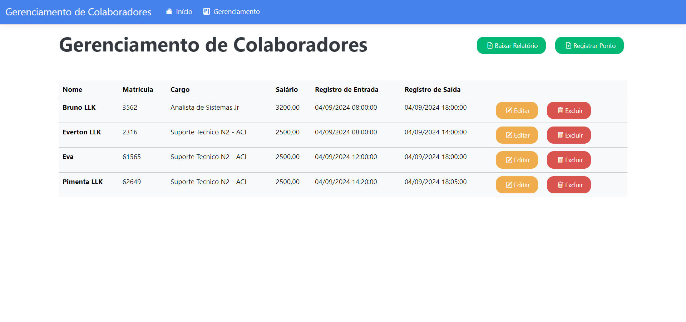
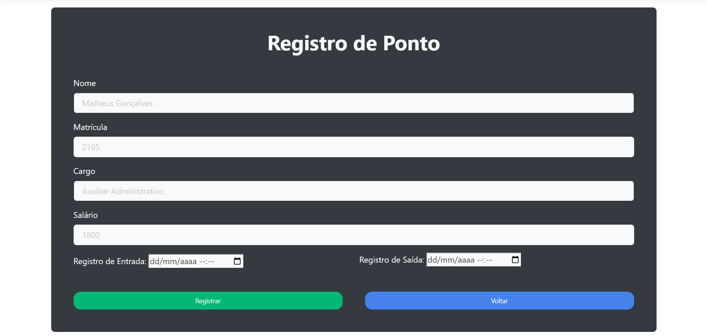
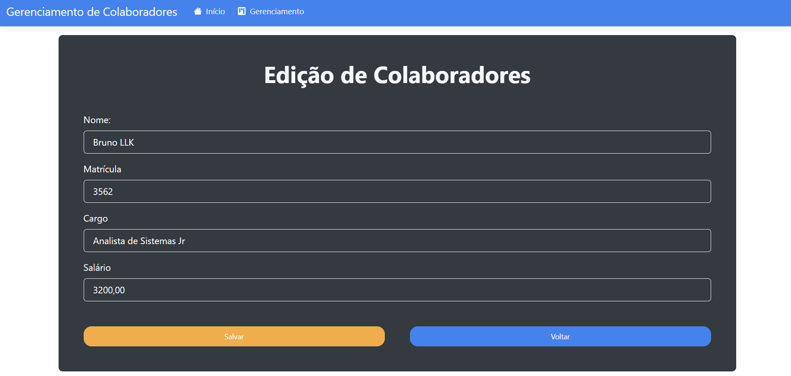
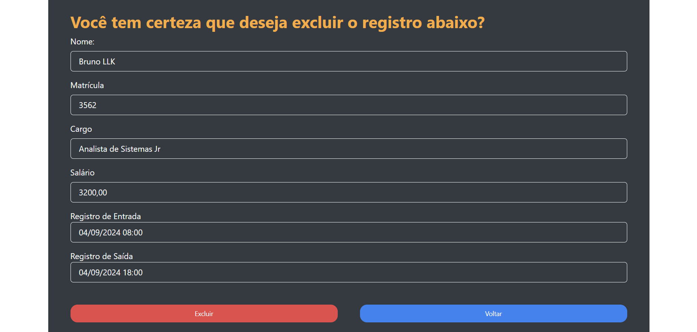
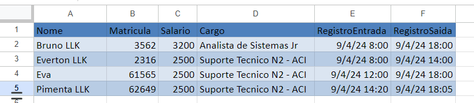

<h1 align="center" style="font-weight: bold;"> Gerenciamento de Colaboradores </h1>

<p align="center">
<a href="#tecnologias">Tecnologias</a> • 
<a href="#instalacao">Instrução de Instalação</a> •
<a href="#preview">Preview</a>
</p>

<p align="center">
    <b>Essa aplicação básica foi desenvolvida com base no teste técnico de Analista de Sitemas Jr do Grupo Aço Cearense com as seguintes funcionalidades principais: Listar, Registrar ponto (limitando para dias úteis e entre 8h e 18h), Editar, Remover e baixar relatório em planilha Excel. </b>
</p>

<h2 id="tecnologias">💻 Tecnologias</h2>

### Back-End:
- C#
- ASP.NET Core MVC
    - Arquitetura clara e organizada, o padrão MVC (Model-View-Controller) promove uma separação clara das responsabilidades, facilitando a manutenção e o teste do código.
    - Integração com outras tecnologias, se integra facilmente com bancos de dados, serviços em nuvem e frameworks JavaScript.

### Front-End:
- HTML
- CSS
- JavaScript
- Bootstrap
    - Com Bootstrap cuidando da parte visual, foquei na lógica de negócio do aplicativo.
    - Facilidade de uso e a curva de aprendizado é relativamente baixa, mesmo para desenvolvedores com menos experiência.
    - Possui uma grande comunidade ativa, o que significa que você encontrará facilmente soluções para seus problemas e exemplos de código.

### Banco de Dados:
- SQL Server
- Entity Framework Core
    - Mapeamento Objeto-Relacional (ORM), permite que você trabalhe com objetos .NET em vez de lidar diretamente com SQL, facilitando o desenvolvimento e a manutenção do código.
    - Migrations, facilita a evolução do esquema do banco de dados ao longo do tempo, evitando alterações manuais no banco de dados. 

<h2 id="instalacao">📦 Instrução de Instalação </h2>

Essas instruções permitirão que você obtenha uma cópia do projeto em operação na sua máquina local para fins de desenvolvimento e teste.

<h3>📋 Pré-requisitos</h3>

- [Visual Studio Code](https://code.visualstudio.com/?WT.mc_id=javascript-0000-gllemos) ou [Visual Studio](https://visualstudio.microsoft.com/pt-br/downloads/?WT.mc_id=javascript-0000-gllemos)
- [.NET SDK](https://dotnet.microsoft.com/pt-br/download/visual-studio-sdks)
- [SQL Server](https://www.microsoft.com/pt-br/sql-server/sql-server-downloads)
- [Git](https://git-scm.com/downloads)

<h3> 🔧 Configuração inicial do projeto </h3>

#### Clonando o projeto

```bash
git clone your-project-url-in-github
```
### Configurando a Base de Dados:

1. Abra o arquivo `appsettings.json` 
2. No SQL Server, clique na `tomadinha`

<p align="center">
  
</p> 

3. Você consegue o nome do `server name`

<p align="center">
  
</p> 

4. Copia e Cola no arquivo `appsettings.json`

<p align="center">
  
</p> 

5. Após isso já vai existir o `Database` e `trusted_connection=true` que são outras questões que você precisa para `ConnectionStrings` 

6. Migration:
- Criando uma `migration` para que o `database` seja criado e consequentemente a tabela `Gerenciador`.
```
add-migration "nomeDaSuaMigration"
```
- Em seguida:
```
update-database
```
7. Pronto! efetivamente está criado no seu banco de dados e agora poderá executar aplicação.

<h2 id="preview"> 📷 Preview do projeto </h2>

<p align="center">
  
</p>
<p align="center">
  
</p>
<p align="center">
  
</p>
<p align="center">
  
</p>
<p align="center">
  
</p>
<p align="center">
  
</p>